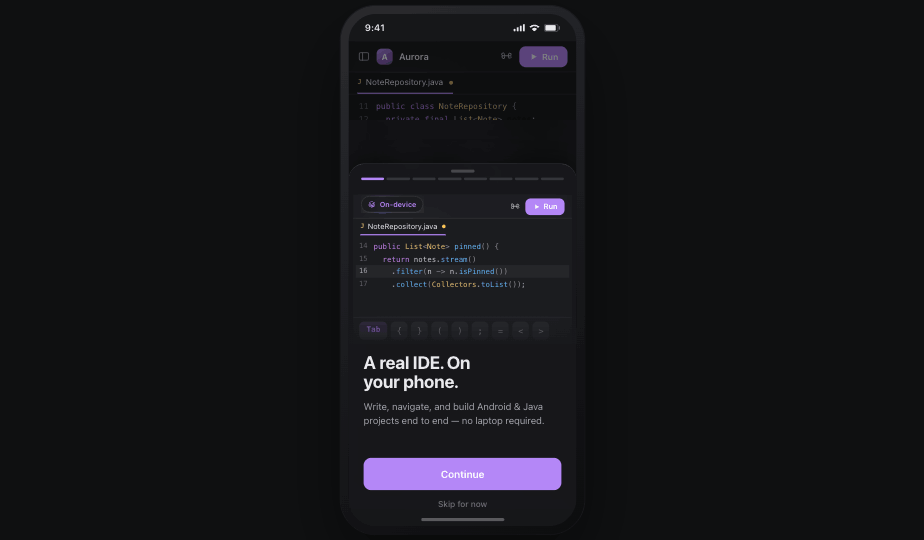
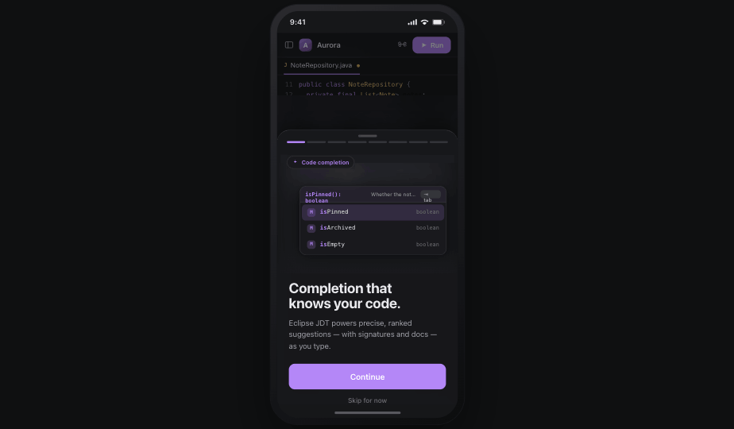
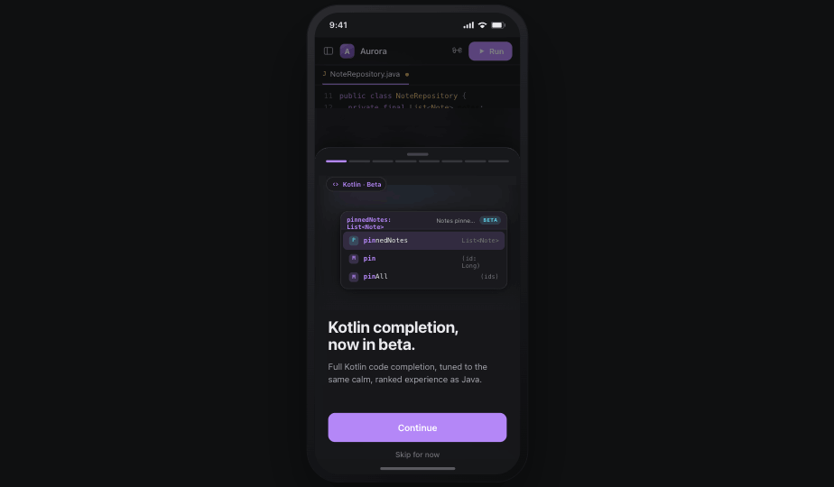
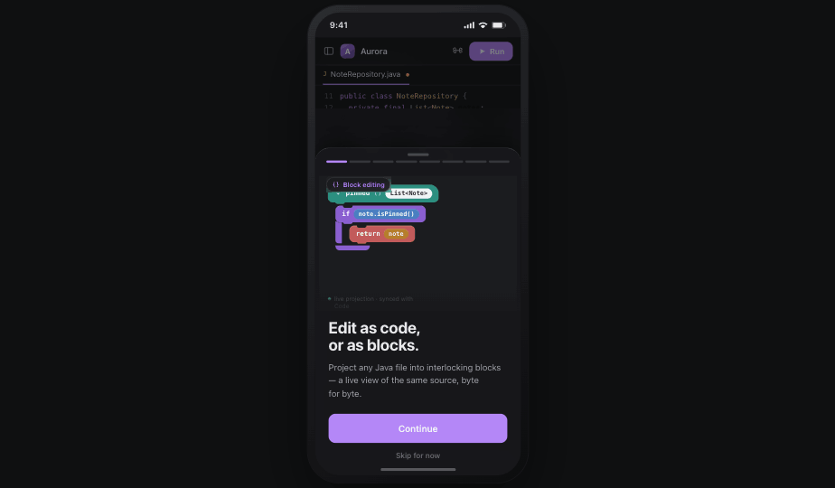
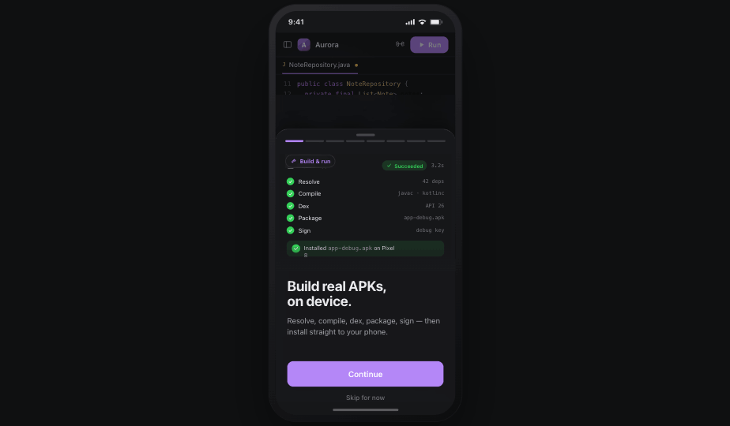
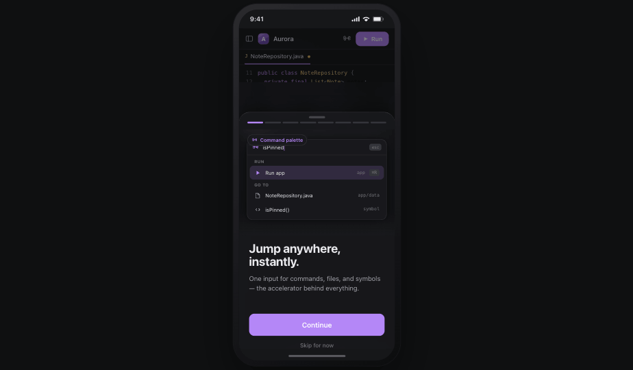
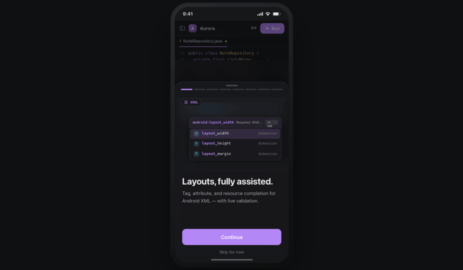
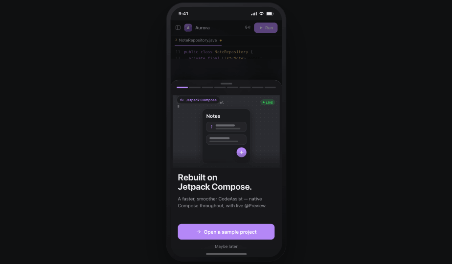
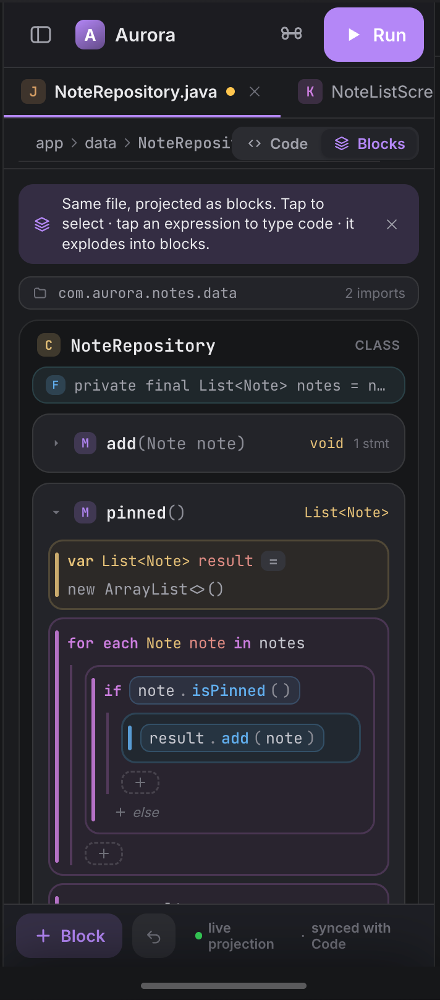
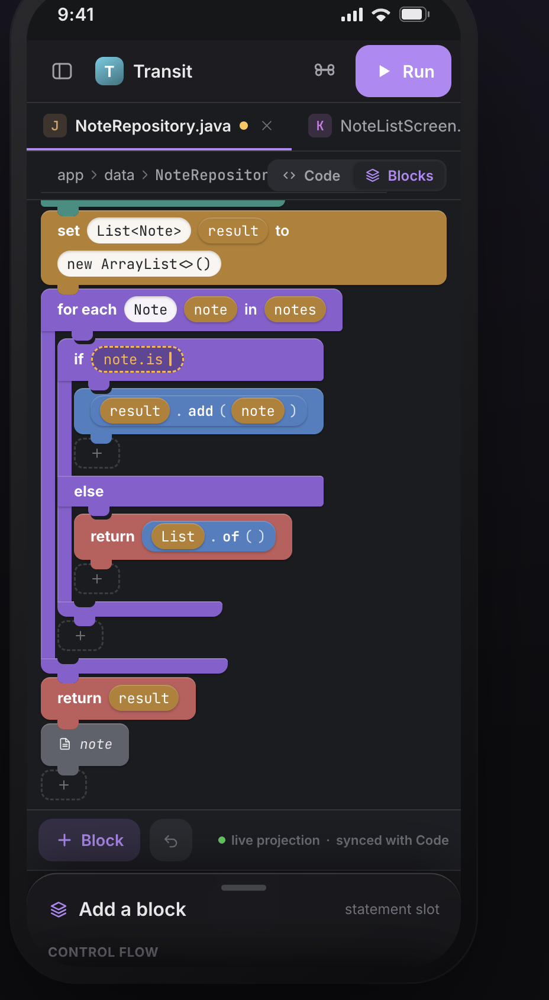

<div align="center">

# CodeAssist

**A lightweight, on-device IDE that edits *and builds* Android & Java projects — no laptop, no Gradle daemon.**

[](https://github.com/tyron12233/CodeAssist/actions)
[](https://github.com/tyron12233/CodeAssist/actions)
[](#benchmarks)
[](https://github.com/tyron12233/CodeAssist/releases)
[](LICENSE)
[](https://github.com/tyron12233/CodeAssist/stargazers)
[](https://github.com/tyron12233/CodeAssist/network/members)
[](https://discord.gg/y2gycT6pDW)



</div>

## What is CodeAssist?

CodeAssist is an extensible IDE framework that runs **entirely on device** (Android/ART) and edits and
builds Android/Java projects **without hosting Gradle**. A full Gradle runtime is too heavy for a phone,
so CodeAssist models projects itself, mimics Gradle's incremental task engine without the Gradle daemon,
and drives the Android toolchain (aapt2, D8/R8, apksigner) directly.

It is designed to be **lightweight**:

- **No Gradle daemon.** Projects are a declarative model compiled into an incremental task DAG with
  fingerprint up-to-date checks and a persistent cache — Gradle's good ideas, none of its weight.
- **Flat-memory indexing.** Library/SDK symbol indices are disk-backed immutable segments queried in
  place through a bounded block cache, so heap stays flat regardless of index size.
- **Fast, incremental everything.** Editing one file re-runs only the affected build tasks; completion
  and analysis reuse a cached compilation environment instead of rebuilding it per keystroke.
- **On-device toolchain.** Pure-Java tools (Eclipse JDT/ecj, D8/R8, apksigner) run in process; native
  aapt2 is invoked as a subprocess.

It ships with a Compose Multiplatform UI and both desktop and Android launchers.

### Highlights

- ☕ **Java code intelligence** — error-tolerant parsing, ranked completion, diagnostics, and quick-fixes
  powered by Eclipse JDT.
- 🟪 **Kotlin completion (beta)** — full Kotlin code completion on device, tuned to the same ranked
  experience as Java. [How it works →](docs/kotlin-completion.md)
- 🧩 **Block editing** — project any Java file into a Scratch-style block tree and edit it there; changes
  write back to the source byte-for-byte. [How it works →](docs/block-editing.md)
- 📐 **Android XML assist** — tag, attribute, and resource completion for layouts/manifests with live
  validation.
- 📦 **Real APK builds on device** — resolve, compile, dex, package, sign, and install — no laptop.
- 🔌 **Extensible everywhere** — module types, build systems, language backends, analyzers, quick-fixes,
  and more all plug in through extension points.

## Screenshots

|  |  |
|---|---|
|  |  |
| **A real IDE, on your phone** — write, navigate, and build end to end. | **Completion that knows your code** — precise, ranked JDT suggestions with signatures and docs. |
|  |  |
| **Kotlin completion (beta)** — the same calm, ranked experience as Java. | **Edit as code, or as blocks** — a live projection of the same source, byte-for-byte. |
|  |  |
| **Build real APKs, on device** — resolve, compile, dex, package, sign, install. | **Jump anywhere, instantly** — one input for commands, files, and symbols. |
|  |  |
| **Layouts, fully assisted** — Android XML completion with live validation. | **Built on Jetpack Compose** — a native Compose UI throughout. |

## Block editor

Any Java file can be projected into interlocking, typed blocks — and edited there. The block tree is a
**live projection of the same DOM the code editor uses**, so the two views never drift; a block edit
compiles to the smallest possible source edit, leaving every untouched line and comment intact.

<div align="center">

&nbsp;&nbsp;&nbsp;

</div>

Typed value sockets (Scratch-style shapes for boolean/number/string/type), inline completion inside
sockets, palette search, and drag-and-drop all map back to the same surgical projection pipeline.
[Read how the projection and edit round-trip work →](docs/block-editing.md)

## Benchmarks

CodeAssist tracks completion quality, editor latency, indexing, and build performance against committed
baselines (a `regressionTest` suite that fails CI on a quality regression). The numbers below regenerate
on each release.

<!-- AUTOGEN:benchmarks:START -->
| Area | Metric | Result |
|---|---|---|
| Java completion **quality** | recall / top-1 / MRR | **100%** / 75% / 0.88 |
| Java completion **latency** (per keystroke) | member access / type ref | **4.3 ms** / 2.8 ms |
| Symbol **index** quality | recall / top-1 / MRR | **100%** / 90% / 0.95 |
| Symbol **index** query | prefix / fuzzy | ~4.4 µs / ~56 ns |
<!-- AUTOGEN:benchmarks:END -->

**What the metrics mean**

- **recall** — fraction of cases where the expected completion appears in the list at all.
- **top-1 / top-5** — fraction where the expected item is ranked first / within the first five.
- **MRR** (mean reciprocal rank) — average of `1 / rank` of the expected item; `1.0` means it is always
  first.
- **latency** — wall-clock time to compute completion at a keystroke (recorded on the maintainer's
  machine, so treat as indicative; quality metrics are deterministic across machines).
- **incremental tasks** — how many build tasks re-run after a single-file edit; fewer means more precise
  incrementality.

## Tests

<!-- AUTOGEN:tests:START -->
**1918** tests passing across **315** suites · 0 failing · 1 skipped (framework / `CI_CORE_ONLY`).
<!-- AUTOGEN:tests:END -->

The badges and the numbers in this section are regenerated automatically on each release (see
[`.github/workflows/update-readme.yml`](.github/workflows/update-readme.yml)).

## Documentation

| Doc | What's in it |
|---|---|
| [docs/architecture.md](docs/architecture.md) | Project model, the two graphs, build abstraction, concurrency model. |
| [docs/modules.md](docs/modules.md) | The module map and responsibilities. |
| [docs/extension-points.md](docs/extension-points.md) | Extension points and the language-backend SPI. |
| [docs/language-support.md](docs/language-support.md) | DOM, completion, the language backends, indexing, analysis, block editing. |
| [docs/kotlin-completion.md](docs/kotlin-completion.md) | How on-device Kotlin completion works. |
| [docs/block-editing.md](docs/block-editing.md) | How the projectional (block) editor works. |
| [docs/build-system.md](docs/build-system.md) | The task engine, the native pipelines, Gradle compat. |

## Module layout

Dependencies point downward only (acyclic). Platform modules carry no domain knowledge; domain behavior
is contributed through extension points.

```
platform-core            no domain knowledge; depended on by all
  └─ vfs-api
       └─ project-model-api
            ├─ build-api
            └─ language-api
deps-api / index-api / analysis-api / block-api  → the layers above
ide-ui (Compose UI) ← ide-core (engine→UI bridge) ← ide-desktop, ide-android
```

The full table — every module, its packages, and its responsibility — is in
[docs/modules.md](docs/modules.md).

## Building

The build uses the Gradle wrapper and a JDK 17+ (developed against the JetBrains Runtime).

```sh
# Core framework only (pure JVM; no Android SDK or Compose shells needed)
CI_CORE_ONLY=true ./gradlew check

# Full build, including the Compose UI and Android launcher (requires the Android SDK)
./gradlew build

# Run the desktop IDE
./gradlew :ide-desktop:run

# Assemble the Android launcher
./gradlew :ide-android:assembleDebug
```

The regression suite (completion quality, latency, allocation, and build-at-scale) is opt-in and runs
via the `regressionTest` tasks against committed JSON baselines.

## Conventions

- IDs are `@JvmInline value class` wrappers — no stringly-typed APIs.
- Open-ended classifications (`NodeKind`, `BuildSystemId`, `LanguageId`) are string-backed value classes
  so plugins can extend them; closed sets (`DependencyScope`, `SymbolKind`) are enums.
- Long-running entry points are `suspend` and run under the read/write-lock discipline; model and DOM
  access happens inside read/write actions.
- Mutation is transactional: stage on a `*Transaction`/`Modifiable*`, then `commit()`.
- Editor features target the neutral `DomNode`/`Symbol`/`Scope`, never a backend's native types.

## License

CodeAssist is free software licensed under the **GNU General Public License v3.0 or later**
(`GPL-3.0-or-later`). See [LICENSE](LICENSE).

## Install

- **Google Play** — testing track (signed via Play App Signing).
- **F-Droid / IzzyOnDroid** — built from this repo, signed with the project's own key. See
  [docs/fdroid-izzyondroid.md](docs/fdroid-izzyondroid.md). (The IzzyOnDroid and Play builds have
  different signatures and cannot update across stores.)

## Community

Join the **[CodeAssist Discord](https://discord.gg/y2gycT6pDW)** to chat, get help, report bugs, and
share what you build.
